## Introduction

Temple Revival is a mini 2.5D Sokoban game implemented with Unity. In this game, users need to push all eight clay pots to the positions of the altars.

I developed this game individually in 2021 to learn the design issues in COMP311 Multimedia Application Development. 

## Media

Different media are applied in this game. For instance, text, audio, images, and animation are provided in this game. Notably, the background music is used for audio and the smooth changes between the different moving statuses of the character are used for animation.

## Game Scenes

There are three scenes in this game: the main menu scene, the playing scene, and the success scene.

When players enter the game, the first scene coming into sight is the main menu scene. As we can see, there are some design elements such as titles, buttons, and the background image in this scene. And among these elements, the buttons are used to achieve the corresponding functions -- playing, showing the instruction, and quitting. For instance, the second picture shows the instruction menu after players press the instruction button. 

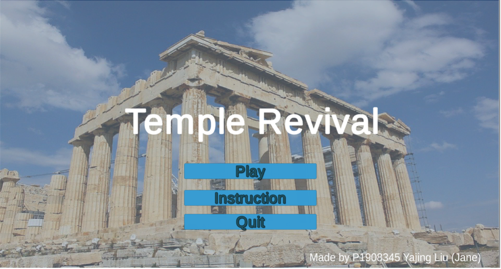

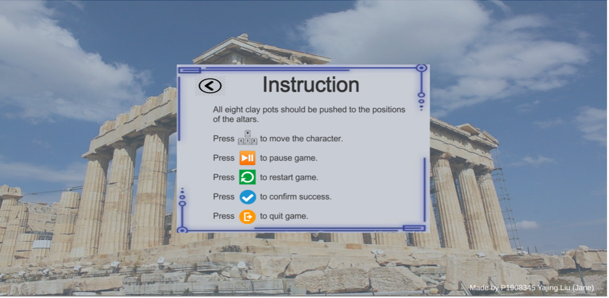

The playing scene is the major scene for users to play. In this scene, an exquisite image of a ruin of a temple is shown. On top of the design, there are some amusing functions in this scene. Taking the pause menu as an example, not only can players interact with the buttons, but also they can use the slider to control the volume of the background music. Another example is that the dialogs can be shown automatically when players approach the sign. Last but not least, the layers of environmental objects can be changed according to the user’s position so that users can have a satisfactory sense of space.

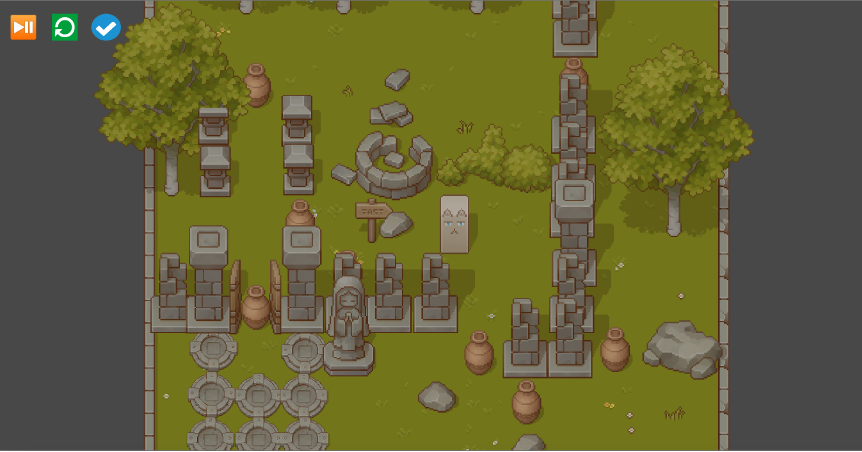

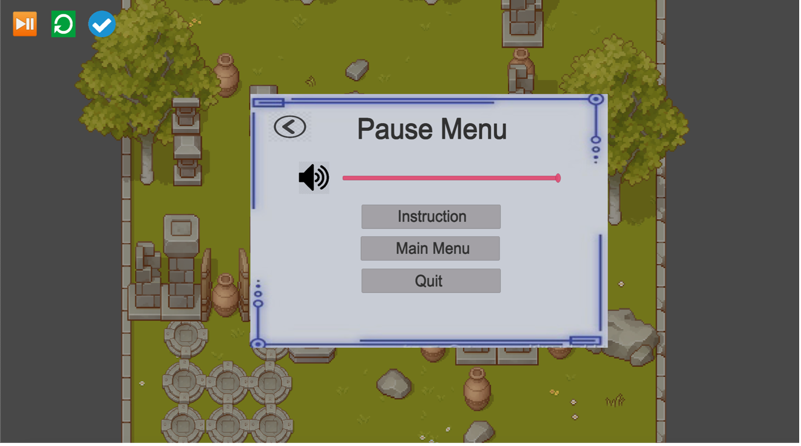

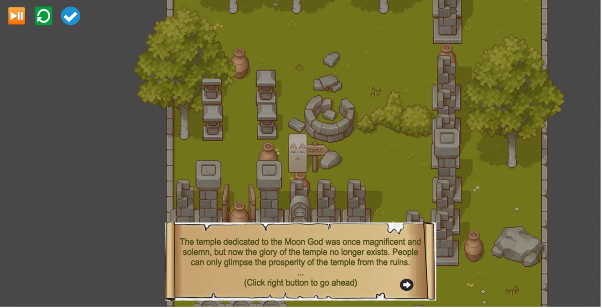

The last scene is the success scene. This scene is quite simple and is just used to celebrate success. In this scene, the temple is revived without any broken walls or scattered stones.

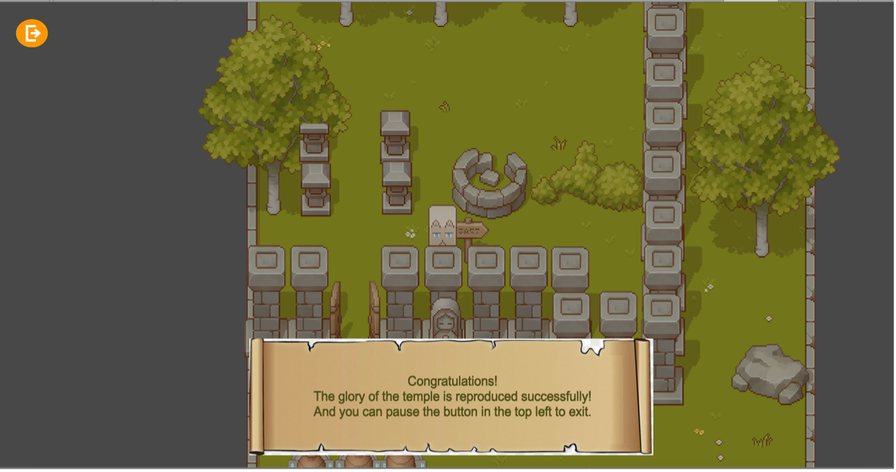

## Design Issues Analysis

### Visual Communication

Visual communication may alter the meaning of what is being communicated by words. In that case, a picture of the solemn ruins of a temple is chosen as the background picture of this main menu. When players see this background, they will connect the game with this picture and know the game is talking about the story of the temple. Besides, blue is the major color in this scene so people can feel a touch of sadness.

### Graphic symbol

Since graphic symbols can transcend language barriers and make players understand complex meaning easily, a host of graphic symbols are used in this game. In addition, these icons draw inspiration from the real world or some common design. Thus, people can understand these icons easily based on their experience.

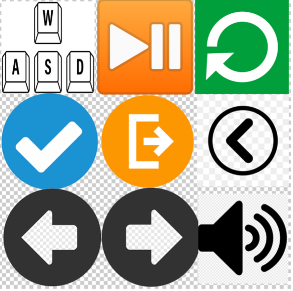

To be more specific,

The first symbol in the first row shows a picture of ‘WASD’. Since the picture looks like the actual keys, it is easy for users to associate the four keys with the keyboard in the real world. 

This second symbol represents the function to pause the game. Since it comes from the actual CD player, it can be understood easily. 

The circular arrow is usually used to stand for recycling or restarting. Thus, it is natural for users to press this button to restart.

The tick usually refers to being successful or completing work. Thus, it is easy for users to connect this button with the confirming-success function. 

The central symbol always represents the exit door in the real world. In this game, users can connect this symbol with the meaning of quitting the game.

The back button refers to going back to the previous page, and it is quite common in the design of websites. When users want to go back to the previous view, it is natural for them to use this button.

The pairs of turning page buttons are popular in e-books. And in this game, it is not complicated for users to press these buttons to turn the page in the dialog.

The last symbol refers to the volume control in some video players. Thus, it can let users know the slider is about controlling the volume of background music.

### Law of Proximity

The spatial or temporal proximity of elements may induce the mind to perceive a collective or totality. In that case, the three buttons in the main menu scene, in the playing scene, and in the pause menu are all put together with each other separately so that users can easily group them.

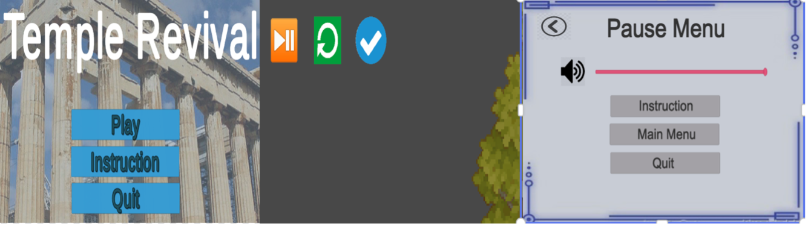

### Law of Similarity

Since the mind groups similar elements into collective entities or totalities, the three buttons in the main menu and in the pause menu are in the same form, color, size, and brightness separately.

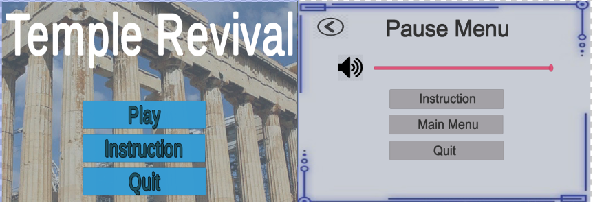

### Law of Symmetry

Since symmetrical images are perceived collectively, the pairs of turning page buttons in the dialog are axial symmetry to let users group them.

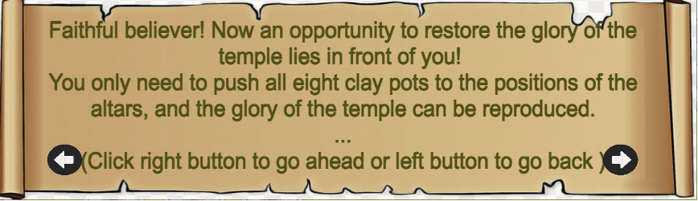

### Law of Closure

Since the mind may experience elements and it does not perceive through sensation, to complete a regular figure, the background picture of menus without full connection will be considered as a full border.

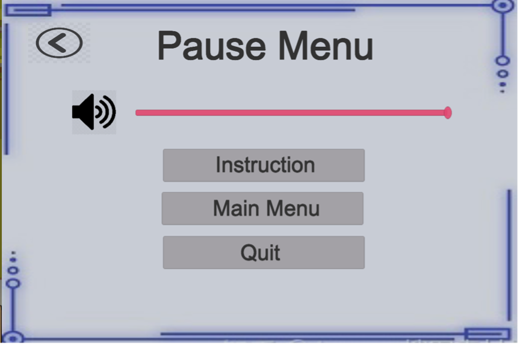

### Visual Hierarchy

A visual hierarchy describes the dominance of one or more elements in the visual field. In this game, the title in the main menu scene is much larger than the buttons. Besides, the title of the instruction menu is larger than the content so that the grouping is disrupted, and the title appears dominant from others.

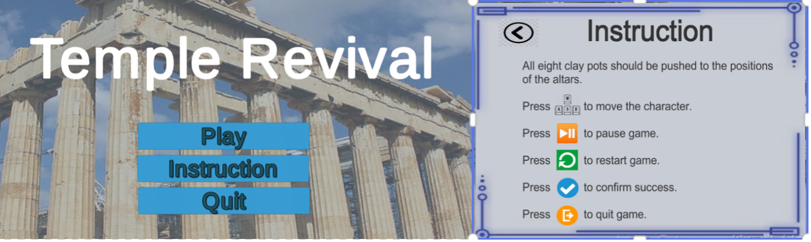

### Tonal Contrast

To make people suffering from defective color vision feel more comfortable, all scenes in the game have been converted to greyscale to test the tonal contrast of colored design.

 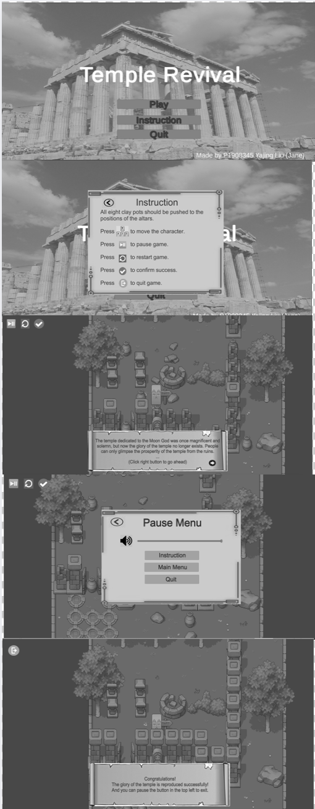

## References

1. Developing Platform: [Unity](https://unity.com/)

2. Asset: [Pixel Art Top Down - Basic](https://assetstore.unity.com/packages/2d/environments/pixel-art-top-down-basic-187605)

3. Tutorial: [M_Studio’s video](https://space.bilibili.com/370283072/channel/seriesdetail?sid=212003), [How can I sort layer automatically in Unity 2D?](https://www.bilibili.com/video/BV1CL41147Ef)

4. Icon Resources: [WASD Picture](https://designbundles.net/dg-store/1310537-wasd-computer-keyboard-buttons-desktop-interface-w), [Quit Icon](https://www.vectorstock.com/royalty-free-vector/logout-exit-icon-symbol-vector-17374520), [Success Icon](https://www.pngkit.com/view/u2t4r5q8o0e6u2o0_success-icon-arrow-icon/), [A Pair of Turning Page buttons](https://www.pngwing.com/en/free-png-zpphi), [Sound Icon](https://www.pngegg.com/en/png-zootf), [Dialog Background](https://www.subpng.com/png-m6eppb/), [Pause Icon](https://emojiterra.com/play-or-pause-button/), [Restart Icon](https://icon-library.com/icon/restart-icon-23.html), [Menu Background](https://www.tspweb.com/key/海报边框.html) and [Game Icon](http://www.51yuansu.com/sc/vcvthbnueu.html)

5. main menu background picture: [Temple Background Picture](https://pixabay.com/zh/photos/parthenon-greece-acropolis-athens-2125566/).

6. Background Music: [BGM-Romance-Cat Glyph v2](https://assetstore.unity.com/packages/audio/music/bgm-romance-147719)